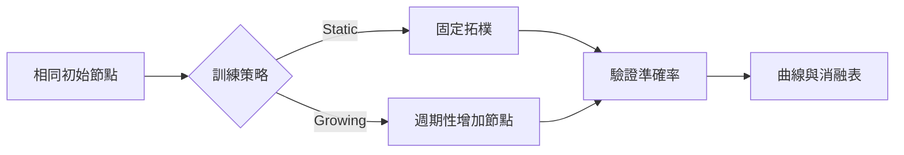

## 研究假設

如果模型能在訓練過程中依照固定週期增加表示節點，它可能比固定拓樸更快吸收新的局部模式。這篇是**排版與互動範例**，數據由可重現的合成實驗產生，不代表正式論文結果。

## 實驗設計

比較兩條控制組：

1. **Static graph**：節點數全程固定。
2. **Growing graph**：每隔數個 epoch 增加一批節點，並加入短暫的結構調整成本。

## 閱讀重點

- 曲線用於觀察增加節點後是否有短暫震盪。
- 指標卡快速比較最終準確率與節點增量。
- 消融表讓不同擴張間隔的結果可以放在同一個版面比較。

## 下一步

正式研究時應替換合成函數、加入多組 seed，並報告平均值、標準差與計算成本。播放器的輸出格式不需要改，只需讓作者部署的實驗模組回傳同一份 JSON 契約。
