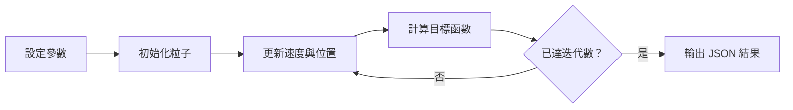

## 研究問題

這是一篇展示用模板，目的不是宣稱新的實驗成果，而是示範如何把「問題、方法、參數與驗證結果」放在同一份研究記錄中。

本範例使用 Particle Swarm Optimization（PSO）搜尋一維 Sphere function 的最小值：

$$
f(x) = x^2
$$

理想解位於 $x = 0$，因此可以用最佳分數是否逐步接近 $0$ 來檢查實作。

## 方法

1. 在 $[-5, 5]$ 之間隨機初始化粒子。
2. 每輪根據慣性、個體最佳位置與群體最佳位置更新速度。
3. 記錄每輪的 global best score，作為收斂軌跡。
4. 使用固定 seed，讓相同參數能重現相同結果。

## 驗證方式

| 檢查項目 | 期待結果 |
| --- | --- |
| 相同 seed 與參數 | 產生相同的輸出 |
| 提高 iterations | 可觀察更長的收斂軌跡 |
| 參數超出範圍 | API 在執行實驗前拒絕要求 |
| stdout 不是 JSON | Runner 回報格式錯誤 |

## 閱讀結果

在下方參數面板調整粒子數、迭代次數與 PSO 係數後，執行器會回傳最佳位置、最佳分數與每輪收斂軌跡。這個區塊可以在未來改成曲線圖或研究專用的結果組件。

## 後續延伸

- 將 Sphere function 替換為實際研究的 objective function。
- 記錄多組 seed 的平均與變異。
- 加入 baseline，避免只展示單一方法的數字。
- 將原始結果匯出為後續分析用的檔案。
