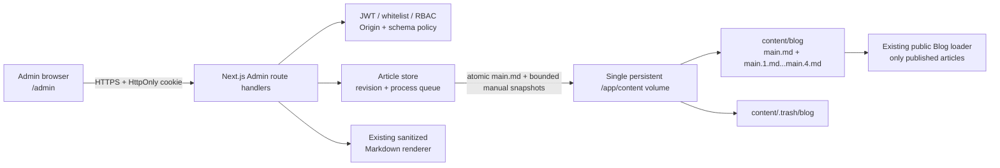

# Admin CMS 架構與安全說明

這份文件記錄內建 Blog Admin CMS 的實際架構、資料完整性設計、威脅模型、限制與作品集能力證據。日常設定、volume、備份、封存復原及錯誤排除請使用 [Admin CMS 維運手冊](./admin-cms-operations.md)。

## 範圍與非目標

CMS 管理 `content/blog/**/main.md`，提供登入、文章列表／搜尋、草稿建立與更新、安全預覽、一秒 debounce autosave、一秒 revision heartbeat、有限檔案版本、發布／取消發布及可復原封存。公開 `/blog` 繼續使用原有 dynamic runtime Markdown pipeline，因此 Admin 儲存已發布文章後不需重建 image，公開內容會讀取更新後的 `main.md`。

目前不管理 `content/site` 或 `content/projects`，也不提供：

- WYSIWYG、媒體庫或附件上傳 API
- archive listing／restore UI、完整且可查詢的 revision history、審批 workflow 或 audit log
- OAuth／SSO／MFA、per-user token denylist 或細粒度 resource RBAC
- distributed lock、多 writer、serverless persistence 或資料庫 transaction
- 自動 backup、retention、object storage 或跨區備援

## 系統脈絡



主要 trust boundaries：

1. Internet／browser 到 TLS reverse proxy。
2. Proxy 到 Next.js Node runtime。
3. Admin route handlers 到 process env 中的 secret／使用者白名單。
4. Node process 到 local persistent filesystem。
5. Live content 到 archive／backup。

瀏覽器只取得 user identity、文章資料與渲染結果，不應取得 JWT secret、password hash、server filesystem path 或 stack trace。

## 元件責任

| 元件 | 責任 |
|---|---|
| `app/admin`、`components/admin` | 登入與 Editorial Operations Console；處理一秒 autosave／heartbeat／安全預覽、Markdown local-tab undo／redo、loading、validation、authorization、conflict、confirmation 與 server-error UI。 |
| `app/api/admin/**` | HTTP boundary、session、Origin、RBAC、write flag、schema 與穩定 JSON envelope。 |
| `lib/admin/config.ts` | Fail-closed env parsing、production secret strength、使用者白名單與 role。 |
| `lib/admin/password.ts` | scrypt hash／verify 與 constant-time key comparison。 |
| `lib/admin/jwt.ts`、`session.ts` | HS256 token、claims、whitelist re-check 與安全 cookie。 |
| `lib/admin/login-limiter.ts` | Per-process failure buckets 與昂貴 scrypt 的 concurrency／queue 上限。 |
| `lib/admin/live-sync.ts`、`editor-history.ts` | Autosave eligibility／revision comparison，以及有界的瀏覽器分頁內 Markdown undo／redo state。 |
| `lib/admin/articles/store.ts` | Slug-to-path、list/read/create/update/archive、revision、manual／autosave mode 與 process-local mutation queue。 |
| `lib/admin/articles/versions.ts` | 將手動及 lifecycle 寫入前的 source 輪替為 `main.1.md`～`main.4.md`，並拒絕不安全的 history path。 |
| `lib/admin/articles/atomic-write.ts` | 同目錄 temporary file、`0600`、`fsync`、close、atomic rename 及 cleanup。 |
| `lib/content/frontmatter.ts` | Parse／serialize 與只重寫 CMS-owned fields 的 patch。 |
| `lib/blog/markdown.ts` | 公開 Blog 與 Admin preview 共用的 Markdown render／sanitize pipeline。 |
| `content/blog`、`content/.trash/blog` | Live source of truth 與 recoverable archive；兩者必須在同 filesystem。 |

## Request、認證與授權流程

### Login

1. Route 載入並驗證 Admin config；設定錯誤回 `503 admin_unavailable`。
2. 驗證 exact Origin／same-origin policy，再以 8 KiB 上限解析 strict JSON。
3. 套用 15 分鐘 in-memory rate-limit buckets，並取得最多 4 concurrent／20 queued 的 scrypt slot。
4. 已知 username 驗證 scrypt；未知 username 也執行 dummy scrypt，client 一律只看到 `401 invalid_credentials`。
5. 成功後簽發 HS256 JWT，寫入 `admin_session` HttpOnly、SameSite=Strict cookie；production 加 `Secure`。

JWT header／claims 是 strict schema，只接受 `alg=HS256`、`typ=JWT`，並驗證 `iss`、`aud`、`iat`、`exp`、`jti`、`sub`、`role`。Token 長度上限 4096。每次 request 都會用 `sub` 重新查詢目前白名單，並要求 role 與 token 相同；因此移除使用者或改 role 會撤銷其既有 token。

只更換 password hash 不會撤銷已登入 session。Logout 只刪除目前 browser cookie，沒有 server-side denylist；緊急撤銷需移除使用者／改 role 或旋轉全域 JWT secret。

### RBAC

| Lifecycle action | editor | admin |
|---|---|---|
| 登入、session、list、read、preview | 可 | 可 |
| 建立 draft | 可 | 可 |
| 更新既有 draft 且仍為 draft | 可 | 可 |
| 建立 published | 不可 | 可 |
| 修改任何既有 published | 不可 | 可 |
| 發布／取消發布 | 不可 | 可 |
| 封存 | 不可 | 可 |

Editor 是受信任的 draft author，但不是 publisher。UI 的 disabled state 只是引導；API route 與 article store 都會再次執行權限政策。

### Origin policy

Login、logout、create、update、archive 與 preview 都要求 `Origin`，拒絕 missing Origin 及 `Sec-Fetch-Site: cross-site`。允許 request URL origin、由 Host 推導的 origin，或 `ADMIN_ALLOWED_ORIGINS` 中的精確值。GET 仍需認證，但不要求 Origin。

Allowlist 不是 wildcard CORS。Production TLS proxy 必須提供正確 Host／scheme，且不能讓 client 繞過 perimeter；額外 origin 應維持最小集合。

## 文章資料模型

Admin model 與檔案格式的 mapping：

| Admin model | Markdown source |
|---|---|
| `slug` | `content/blog/<one-or-two-segments>/` |
| `title` | frontmatter `title` |
| `date` | frontmatter `date` |
| `description` | frontmatter `summary` |
| `tags` | frontmatter `tags` |
| `published` | frontmatter `published`，缺省為 `false` |
| `content` | Markdown body |
| `revision` | 整份原始 `main.md` 的 SHA-256 |
| `updatedAt` | `main.md` mtime |

API 刻意使用 `description` 以配合 Admin model，但 disk/public schema 使用 `summary`。CMS 不會寫入 `description:` frontmatter。

`main.md` 是唯一 live source。`main.1.md`～`main.4.md` 是同目錄的 bounded snapshots，不納入 Admin model，也不會被公開 loader 當成文章。它們由 Git 與 Docker build context 忽略，但在 runtime persistent volume 上存在，並會隨整個 article directory 一起封存。

Blog schema 另接受 `coverImage`、`featuredRank`、`order`、`relatedProjects`、`series` 與其他 passthrough keys。Admin create 不曝露這些欄位；Admin update 透過 `patchFrontmatter` 重寫 `title`、`date`、`summary`、`tags`、`published` 與 body，同時保留其他 raw frontmatter lines。Managed key 原有的註解／格式會被替換，保留欄位也可能移到 managed block 後，因此內容驗證仍是部署 gate。

新文章與既有文章共用同一套 safe path policy，可原樣使用 1–2 層的大小寫、點號、括號、內部空格、底線與 Unicode 路徑。這讓作者能在 `CaseStudy`、`LeetCodeEssential150` 等既有大駝峰目錄中建立新文章，而不改寫已發布 URL。Policy 拒絕空白邊界、空 segment、`.`／`..`、結尾點號、percent ambiguity、slash／backslash、控制字元、Windows reserved names、超長與超過兩層的路徑。API client 對每個 segment 分別編碼，server 驗證 raw route 不含 encoded separator，再以 decoded segments 配合 portable case／Unicode collision、realpath boundary、一般檔案／目錄與 symlink checks。新的一層文章仍不能同時成為兩層 series 的父節點。

Admin client 將同一份 flat article API response 依 `pathSegments[0]` 投影成可摺疊文章樹；這只是 view model，不新增 category database 或空目錄 API。從類別標題建立文章時，client 預填該類別的 exact-case prefix；「新增類別」會開啟第一篇文章草稿，等 create 成功後才由既有 atomic writer 建立 `<category>/<article>/main.md`。整個側欄也能從 layout 移除，讓 editor／preview 使用完整 workspace 寬度。

## 寫入完整性

### Create／update、autosave 與版本輪替

每個 real Blog root 在同一 Node process 中共享一條 mutation queue，避免同 process 的 create／update／archive 交錯。Create 先驗證目的目錄不存在；update 先重新讀取 source，將 request revision 與目前整檔 SHA-256 比較，不同時回 `409 revision_conflict` 及目前 revision／mtime。

新文章沒有 server revision，因此 UI 要求第一次以明確的手動儲存建立 `main.md`；建立時沒有前版可輪替。既有文章的 update 必須帶 `saveMode`：

- `autosave`：使用者停止符合資格的修改 1 秒後送出，只原子取代 `main.md`，不觸碰 `main.1.md`～`main.4.md`，也拒絕任何 published lifecycle transition。
- `manual`：手動儲存、發布及取消發布都使用此模式。寫入前把目前 `main.md` 保存為 `main.1.md`，較舊快照依序後移，最多保留至 `main.4.md`；連同 live `main.md` 合計五份。

Markdown／slug 使用相同的一秒 debounce 呼叫既有 server-side sanitizer 更新安全預覽。Client 以 sequence 丟棄 stale response；背景更新不強制切換 mobile tab。Save success 只採用 server 回傳的 slug、published、revision 與 timestamp，不以正規化後的 Markdown 重設 textarea，藉此保留游標、selection 與使用者原始換行手感。

若 autosave 已多次改寫 live source，下一次 manual update 會把當下最新的 `main.md` 放入 `main.1.md`。Manual writer 先驗證 `main.md` 與既有版本都是一般檔案而非 symlink，再把每個 next value 與 rollback value 寫入同目錄、完成 `fsync` 的暫存檔；全部 staging 成功才依 `main.4.md` 往 `main.md` 的順序 commit。若任一受捕捉的 rename／remove 失敗，會以 rollback stages 還原原本的檔案集合、內容、mode 與 timestamps。這不是帶 durable journal 的 crash-recovery transaction：process／OS 在多次 rename 中間被強制終止仍可能留下部分輪替，也不是不可變 revision store 或 audit log。

寫入流程為：

1. 在 `main.md` 同一目錄用 exclusive `wx` 建立 random temporary file，mode `0600`。
2. 寫入 UTF-8、`fsync`、close。
3. 以同 filesystem `rename` 取代目標。
4. Finally 清除殘留 temporary file，成功後清 mtime content cache。

Autosave 的單檔流程可避免正常 single-process crash 留下半份 `main.md`；manual 多檔輪替則能回復受捕捉的 I/O failure，但沒有 crash journal，也不是 distributed transaction。若兩個 processes 同時讀到相同 revision，各自的 in-memory queue 看不到對方，仍可能 lost update；因此 single writable instance 是硬性架構限制。

### Revision heartbeat 與本機編輯 history

選取既有文章時，visible／online 的已認證 Admin browser 每 1 秒呼叫 `GET /api/admin/posts/<slug>?view=revision`。這個 view 只讀取並回傳整檔 SHA-256 revision 與 mtime，避免每次 heartbeat 傳回完整 Markdown。它是 polling 協調層，不是 WebSocket 或 distributed lock；server write 仍以 request revision 做最終 optimistic-concurrency gate。

Remote revision 改變時，乾淨且沒有 save in flight 的表單會重新讀取完整文章；dirty 或正在儲存的表單則保留本機資料、建立 conflict state 並停用 autosave，不能被 heartbeat 靜默覆蓋。頁面 hidden、offline、尚未選取已建立文章或已有 conflict 時不持續發出 revision request。

Markdown textarea 另有瀏覽器分頁內的 bounded undo／redo state，支援 `Ctrl/Cmd+Z`、`Ctrl/Cmd+Shift+Z` 與 `Ctrl/Cmd+Y`。它在文章切換或 reload 時重設，只涵蓋本機 Markdown 編輯，不是 server persistence、backup、audit 或跨分頁協作機制。

### Archive

Archive ID 為 `<epoch-ms>-<UUID>`。系統先 atomic-write：

```text
content/.trash/blog/<archiveId>/archive.json
```

Manifest 僅含 `archiveId`、`archivedAt`、`slug`，接著把整個 article directory（含附件及現有 `main.1.md`～`main.4.md`）`rename` 至 archive root 下的原 slug 路徑。Archive 本身不新增或輪替 history；兩層 slug 若留下空 series parent，系統會嘗試移除該空目錄。

Archive 不含 checksum、actor、reason 或 previous revision，也沒有 restore endpoint。它保護誤操作的可恢復性，不保護 volume 遺失、惡意 host access 或 archive 本身損毀；完整人工程序見維運手冊。

## Markdown 與公開內容

Admin preview 直接呼叫公開 Blog 相同的 renderer。Raw HTML 未開啟，輸出經 `rehype-sanitize`；link 只允許 `http`、`https`、`mailto`、`tel`、安全 relative path 與 hash，image 只允許 `http`、`https` 與安全 relative path。Relative asset 會限制於文章內容根目錄。

Renderer 支援受控的 `youtube-nocookie.com` iframe。外部 `http(s)` link、image 及 embed 仍會使訪客連線至第三方，可能洩漏 IP／referrer 或受第三方可用性影響；publisher 應把內容 author 視為受信任角色並審查外部資源。

公開 list/detail route 是 force-dynamic 且只顯示 `published` 文章。Admin 儲存既有 published 文章後，公開 loader 依新的 `main.md`／mtime 更新內容，不需要重新 build；這也代表受權 admin 的變更一旦儲存就會直接影響公開站。Draft 仍以明文存在 persistent volume、archive 與 backup；若 host、volume、備份權限或錯誤的 static file server 暴露內容，應用層 published filter 無法保護 draft confidentiality。

## 威脅模型

### 保護資產

- JWT signing secret、password hashes 與使用者／role 白名單
- Draft、published Markdown、文章附件與 optional frontmatter
- Archive、backup、內容完整性與服務可用性
- 發布權限與 public site 的供應鏈可信度

### 信任假設

- TLS、DNS、reverse proxy 與 Host／client-IP header rewriting 由可信維運者控制。
- Host、container runtime、secret manager、persistent volume 與 backup store 未遭入侵。
- 只有一個 writable Node process，filesystem 支援可靠 `fsync` 與 same-filesystem atomic rename。
- Admin 是可信 publisher；editor 是可信 draft author，但其內容必須由 admin 才能發布。
- Production 不會把 repository、`.env*`、content volume 或 archive 當成 public static root。

### 威脅、控制與殘餘風險

| 威脅 | 現有控制 | 殘餘風險／維運責任 |
|---|---|---|
| Credential brute force／username enumeration | scrypt、timing-safe compare、未知帳號 dummy hash、統一 credential error、15 分鐘 buckets、4 active／20 queued scrypt | Limiter 只在記憶體且 per-process，restart 會清除；未可信 proxy 時 client bucket 是全站共享 100 次。Perimeter 仍需流量監控／rate limit。 |
| 偽造 client IP／DoS | Proxy headers 預設不信任；開啟時有 client、credential、identity 三層 buckets | 若 proxy 可被繞過或不覆寫 headers，`ADMIN_TRUST_PROXY_HEADERS=true` 可被 spoof；目前無 distributed limiter，429 也沒有 `Retry-After` header。 |
| JWT 偽造／竊取 | 32-byte CSPRNG secret、HS256 strict claims、短 TTL、HttpOnly／Strict／Secure cookie、每 request whitelist／role re-check | 無 JTI denylist。竊取 token 在 TTL 內有效；以使用者移除／role 變更或 secret rotation 緊急撤銷。XSS 不能直接讀 HttpOnly cookie，但可在受害瀏覽器發 request。 |
| CSRF／cross-origin mutation | Mandatory Origin、cross-site Fetch Metadata rejection、SameSite=Strict、exact allowlist | TLS／Host misconfiguration 可能造成誤拒或錯誤放行；allowlist 與 proxy 必須最小化並測試。 |
| Editor 越權發布 | Route 與 store 雙層 RBAC；editor 只可 draft → draft | Admin 帳號遭入侵即有完整 lifecycle 權限；無 MFA、approval 或 dual control。 |
| Path traversal／symlink escape | Canonical create slug；獨立 legacy-safe existing slug；segment-wise URL encoding；拒 encoded separator／percent ambiguity／dot segment／backslash；realpath boundary、directory/file type 與 symlink checks | 擁有 host filesystem 權限的攻擊者不在此 boundary 內；runtime RCE 可使用 process 可寫的整個 `/app/content`。 |
| Stored XSS／不安全 URL | Raw HTML disabled、URL protocol policy、`rehype-sanitize`、preview 與 public 共用 pipeline | 外部 image/link/embed 仍有 privacy／tracking 風險；sanitize policy 更新需 regression tests。 |
| Stale overwrite／半寫檔 | 每秒 authenticated revision heartbeat、dirty/conflict 保留本機內容、SHA-256 revision、409、process queue、temporary file + fsync + atomic rename | Heartbeat 是 polling 且 queue 不跨 process；NFS／非標準 FS semantics、disk-full 或 OS crash 仍需 backup／restore test。 |
| Markdown 大面積誤刪 | Local-tab `Ctrl/Cmd+Z`／redo，以及手動寫入前最多四份 filesystem snapshots | Autosave 可能在 1 秒後寫入刪除；undo state 在切換文章、reload、關閉或 crash 後消失，filesystem snapshots 也只在 manual／lifecycle save 時輪替且與 live data 同 volume。仍需外部 backup。 |
| 誤刪與 archive 損毀 | Recoverable directory archive + manifest，同 FS rename | Archive 與 live content 在同 volume、無 checksum／retention／restore UI，因此不是 backup。 |
| Secret／draft 洩漏 | `.env*`、`.trash` 排除 Git／Docker context，CI committed-secret pattern scan，stable generic API errors | Secret manager、logs、host ACL、backup encryption 與 repository review 仍是維運責任。Pattern scan 不是完整 secret scanner。 |
| Dependency compromise | Lockfile、frozen install、production audit、tests、build、container non-root | Dev toolchain 仍是 supply-chain surface；需更新 actions／packages、保護 CI token 與 review lockfile diff。 |
| Service availability | Body limits、login hash queue、single process mutation serialization | 單 writer 是 availability bottleneck；磁碟滿、`EACCES`、`EXDEV` 多數對 client 只呈現 generic 500，需監控 server logs、volume capacity 與 backup。 |

### Perimeter 注意事項

Repository 的 `nginx.conf` 只 listen HTTP 80，沒有在此檔內終止 TLS，也未設定 HSTS／CSP。Production 必須在可信 ingress／load balancer 完成 HTTPS 與必要 security headers，並確認 app 收到正確 Host／scheme。Nginx `client_max_body_size 10m` 大於 Admin app 的 512 KiB（login 8 KiB）；app limit 才是實際上限。

Container 以 UID/GID 1001 執行降低預設權限，但它可寫整個 mounted `/app/content`；若 runtime code execution，site、projects、Blog 與 archive 都可能受影響。應以 read-only root filesystem、最小 Linux capabilities、受限 network egress 與 volume／secret ACL 補強 deployment perimeter；套用前需自行確認 Next.js standalone 所需的可寫 runtime path。

## Single writer 與非 serverless 原因

`processMutationQueues` 只存在單一 JavaScript process 記憶體，login limiter 也同樣不共享。Serverless invocation、多 worker process、多 pod 或多 region 各有獨立 state：

- 兩個 update 可同時通過相同 revision check，再互相覆蓋。
- Create／archive 的 path check 和 rename 可能競爭。
- Rate limit 可被分散繞過，或不同 instance 呈現不一致狀態。
- Ephemeral filesystem 的成功寫入可能在下一次 invocation 消失。
- 不同 mount／filesystem 的 archive rename 會以 `EXDEV` 失敗。

因此 production topology 應只有一個 write-enabled instance 和一個 persistent content volume。可有 read-only replicas，但必須設 `ADMIN_CMS_WRITE_ENABLED=false` 並確保 Admin mutation traffic 只到 writer；public read caching 與 volume coherence 也需由部署平台驗證。

## File CMS 遷移觸發條件

出現任一條件，就不應繼續擴充 local-file workaround：

- 需要兩個以上 writable instances、rolling writer HA、autoscaling、serverless、edge 或 multi-region active-active。
- 多人高頻同時編輯，409 已成為常態，或需要 record／field-level locking 與 transaction。
- 需要完整 revision history、diff、audit actor／reason、審批、scheduled publish、soft-delete retention 或一鍵 restore。
- 需要 SSO／MFA、組織／文章級權限、即時 session revoke 或集中式 rate limit。
- 附件量／尺寸成長，需要 multipart upload、object lifecycle、CDN、virus scan 或 signed URL。
- Volume driver 無法保證 atomic rename／fsync，備份與 RPO／RTO 無法達標，或需要跨區災難復原。
- 內容數量／搜尋／關聯查詢超出每次 filesystem scan 與 Markdown parsing 可接受範圍。

建議演進方向是 PostgreSQL 管 metadata、workflow、revision、audit 與 authorization；S3-compatible object storage 管媒體；保留 Markdown import／export 作為可攜格式。遷移前先凍結 writer、做完整 content＋archive snapshot，建立 slug／revision 對照與 checksum，再以 dual-read／驗證報表切換；不要讓 database 與檔案同時成為可寫 source of truth。

## 作品集三類能力證據

| 能力類型 | Repository 中的具體證據 | 可展示重點 |
|---|---|---|
| UX／產品介面 | `app/admin/**`、`components/admin/**`、`app/globals.css` | 延續 pixel-night 視覺的 editorial log、responsive editor／preview、published／draft state、confirmation dialog、loading／empty／validation／authorization／409／server error、visible focus、labels／live regions、reduced-motion CSS。 |
| 後端／安全工程 | `app/api/admin/**`、`lib/admin/**`、`lib/content/frontmatter.ts`、`tests/admin-*.test.ts` | JWT／whitelist／RBAC、same-origin、strict schema／body limits、slug boundary、sanitized preview、optimistic concurrency、atomic write、recoverable archive 與 failure envelope。 |
| Infra／維運工程 | `Dockerfile`、`.env.example`、`.github/workflows/ci.yml`、兩份 Admin 文件 | Non-root UID/GID 1001、writable same-volume contract、secret／hash generators、production audit、committed-secret scan、Docker named-volume write smoke、backup／restore／rotation／migration runbook。 |

這三類證據說明的是程式碼與 CI／文件中的可檢查能力，不等於所有 production 情境都已實機驗收。

## 驗證狀態與已知風險

- Production dependency audit 為 0。完整 development-tree audit 仍有 dev-only `ESLint → minimatch 3 → brace-expansion` advisory；brace-expansion v5 API 與該舊 consumer 不相容，故 CI 使用 `pnpm audit:prod`，等待上游 minimatch 3 consumer 更新，而不是以破壞性 override 隱藏。
- CI 定義 non-root named-volume directory/write smoke，但 production volume 組態尚未在本機 Docker 實際走完登入、create、update、archive、container restart 與 persistence 驗證。
- Admin UI 的 responsive code 與 accessibility states 可在 source 中檢查，但尚未使用 Codex in-app Browser 對 360 px、768 px、1280 px 等 viewport 實測；不得把現況標為已完成 viewport QA 或已驗證 screenshots。
- 沒有 distributed locking、central rate limiting、完整 revision／audit trail、MFA、server-side token revocation、automatic backup／restore 或 archive checksum。現有 local-tab undo 與同 volume 的四份 snapshots 不能補足這些限制；它們不是待部署參數可以升級成的完整保護。
